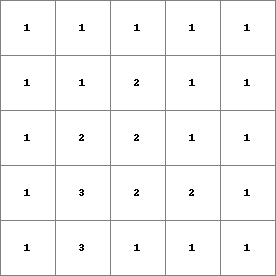
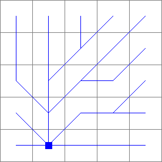

### PCRaster Map Algebra

#### Visualize map file

> aguila buildg.map dtm.map gwlevel.map roads.map

> gdal.Open(src_filename)

> gdal.Translate('dst_filename, src_ds, format='PCRaster', outputType=gdalconst.GDT_Int32, metadataOptions='VS_NOMINAL')

> RasterLayer.GeoTransform()

> RasterLayer.GetProjection()

> pycrs.parse.from_ogc_wkt(RasterLayerProjection)

> RasterLayer.GetDescription()

> Buildings = pcraster.readmap("buildg.map")

> pcraster.aguila(Buildings)

> IndustryDistance = spread(Industry,0,1)

#### Save map file to Disk

> report(NotDeep, "notdeeep.map")

[https://github.com/jvdkwast/PCRasterTutorials/blob/main/GroundwaterInterpolation/Groundwater_level.ipynb](https://github.com/jvdkwast/PCRasterTutorials/blob/main/GroundwaterInterpolation/Groundwater_level.ipynb)

#### Create a map or change existing map

> mapattr -p clone.map

- Convert a CSV file to PCRaster map format:

> col2map -S -x 2 -y 3 -v 1 boreholesdxy.csv boreholedepth.map --clone clone.map

> BoreholeDepth = readmap("Boreholedepth.map")

> Mask = readmap("clone.map")

> BoreholeDepthIDW = inversedistance(Mask, BoreholeDepth, 2, 0, 0)

> aguila(BoreholeDepthIDW)

> Thiessen = spreadzone(BoreholeID, 0, 1)

[https://github.com/jvdkwast/PCRasterTutorials/blob/main/PCRasterCatchmentDelineation/ContentsCatchmentDelineation.ipynb](https://github.com/jvdkwast/PCRasterTutorials/blob/main/PCRasterCatchmentDelineation/ContentsCatchmentDelineation.ipynb)

#### Stream and Catchment Delineation

- Build Mosaic

> gdal.BuildVRT("file.vrt", inputTifFiles)

- inputTifFiles are from: glob iterative

#### FlowDirection

> from pcraster import *

> DEM = readmap('dem.map')

> FlowDirection = lddcreate(DEM,1e31,1e31,1e31,1e31)

> DEMFilled = lddcreatedem(DEM, 1e31,1e31,1e31,1e31)

> StrahlerOrder = streamorder(FlowDirection) # streamorder(ldd)

`areaclass Identifies the class to which a cell belongs: cells with corresponding values on areaclass are member of a separate class. For each separate class the maximum expression value of the cells belonging to that class is determined. This value is assigned to all cells belonging to that class. This is done for all classes and saved as Result.`

> areamaximum(expression, areaclass)

- Which Strahler Order is big enough to be considered it as a river:

> mapmaximum(StrahlerOrders)

Calibration
-----------

- FlowDirection

> FlowAccumulation = accuflux(FlowDirection)

RiverFlow = ifthen(FlowAccumulation > 9000, boolean(1))

River Outlet and Inlet
--------------------------------

Read coordinates from stream8.map aguila

> col2map -N location.txt location.map --clone stream8.map

> Outlet = readmap("location.map")

> RunCatchment = catchment(FlowDirection, Outlet)

> outlets = pit(FlowDirection) # find all the pits in the flow FlowDirection

> catchments = catchment(FlowDirection, outlets)

> aguila(catchments)

> ConvertToPCRaster | CalculateFlowDirection | StreamDelineation | col2map

